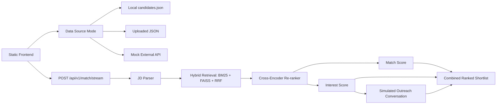

# AI-Powered Talent Scouting & Engagement Agent

A FastAPI-based recruitment intelligence demo that parses job descriptions, retrieves relevant candidates, ranks the shortlist, and generates recruiter-ready explanations. The app is designed for local demos while showing how production systems separate matching logic from candidate data ingestion.

## Highlights

- Static frontend served by FastAPI
- Local candidate dataset with runtime data-source switching
- Upload JSON flow with candidate schema validation
- Simulated external candidate API for demo ingestion
- Job-description parsing with role, skill, salary, and work-mode extraction
- Hybrid retrieval with BM25, dense embeddings, FAISS, and reciprocal rank fusion
- Cross-encoder re-ranking
- Technical match, engagement, flight-risk, and final ranking scores
- SSE streaming for progressive frontend results
- Structured stage-specific API errors
- Deterministic fallback behavior when optional LLM generation is unavailable

## Architecture



## Scoring Logic

The recruiter sees both the separate dimensions required by the problem statement and a combined ordering score.

- `Match Score`: weighted skill coverage, mandatory-skill coverage, experience fit, role alignment, trajectory boost, semantic similarity, and cross-encoder evidence.
- `Interest Score`: salary alignment, availability, and engagement probability.
- `Flight Risk`: tracked separately using tenure and career-movement signals so it does not pollute the interest score.
- `Final Score`: `0.50 * Match Score + 0.25 * Interest Score + 0.25 * Cross-Encoder Score`.
- `Simulated Engagement`: generates recruiter/candidate transcript turns for consent, interest, salary, and availability, then exposes structured interest signals.

## Sample Use Case

Input:

```text
We are hiring a Senior Machine Learning Engineer for a talent intelligence platform.
Must have Python, FastAPI, PyTorch, Docker, AWS, MLflow, and vector search.
Nice to have RAG. Salary budget is $50,000 to $65,000 and this role is remote.
```

Output highlights:

```json
{
  "candidate_name": "Rohan Mehta",
  "match_score": 84.9,
  "interest_score": 78.6,
  "final_score": 82.4,
  "missing_skills": ["Vector Search"],
  "recommendation": "Review manually before outreach due to missing critical skills.",
  "engagement_conversation": {
    "signals": {
      "consent_given": true,
      "interest_level": "high",
      "salary_alignment": "aligned",
      "availability_days": 21
    }
  }
}
```

## Submission Checklist

- Working prototype: run locally with the command below or deploy the FastAPI app.
- Public repo: include this README and source code.
- Architecture: see the Mermaid diagram above.
- Scoring description: see `Scoring Logic`.
- Sample input/output: see `Sample Use Case`.
- Demo video: record the frontend flow from Data Source selection through ranked shortlist and engagement transcript.

## Setup

Use Python 3.11 for the full local stack.

```powershell
py -3.11 -m venv .venv
.\.venv\Scripts\activate
pip install -r requirements.txt
```

## Run

```powershell
.\.venv\Scripts\python -m uvicorn app.main:app --host 127.0.0.1 --port 8000
```

- Frontend: `http://127.0.0.1:8000/`
- API docs: `http://127.0.0.1:8000/docs`
- Health: `http://127.0.0.1:8000/api/v1/health`

Optional `.env` values:

```env
GROQ_API_KEY=
LOG_LEVEL=INFO
```

When `GROQ_API_KEY` is not configured, scoring still runs deterministically and JD generation uses a local fallback template.

## Data Source Modes

The frontend includes a `Data Source` selector:

- `Local Dataset`: uses `data/candidates/candidates.json`.
- `Upload JSON`: validates uploaded records and activates them for the current runtime session.
- `Simulated External API`: loads candidates through a mock external-source endpoint.

Upload records must include:

```json
[
  {
    "name": "Neha Kapoor",
    "skills": ["Python", "FastAPI", "PostgreSQL"],
    "experience": 4,
    "salary": 70000
  }
]
```

The upload flow also accepts `full_name`, `total_experience_years`, and `expected_salary_usd` aliases so full candidate records can be reused.

## API Reference

### `GET /api/v1/data-source`

Returns the active candidate source and candidate count.

### `POST /api/v1/data-source/local`

Switches matching back to the checked-in local dataset.

### `POST /api/v1/data-source/upload`

Activates uploaded candidate JSON after validation.

```json
{
  "candidates": [
    {
      "name": "Arjun Rao",
      "role": "ML Engineer",
      "skills": "Python, PyTorch, AWS",
      "experience": "6",
      "salary": "95k"
    }
  ]
}
```

### `GET /api/v1/mock-candidates`

Returns candidate data in the same structure a real external system could provide.

### `POST /api/v1/data-source/mock-api`

Activates the simulated external API dataset for matching.

### `POST /api/v1/match`

Runs the matching pipeline and returns ranked candidates.

```json
{
  "job_description": "We are hiring a Senior Machine Learning Engineer. Must have Python, FastAPI, PyTorch, Docker, AWS, MLflow, and vector search. Nice to have RAG. Budget is $50,000 to $65,000 and the role is remote.",
  "top_k_search": 10,
  "top_k_final": 5,
  "page": 1,
  "page_size": 5,
  "include_outreach": true
}
```

### `POST /api/v1/match/stream`

Returns `text/event-stream` events:

- `progress`
- `candidate`
- `result`
- `error`

## Development

Run the test suite:

```powershell
.\.venv\Scripts\python -m pytest tests -q
```

Build or refresh the FAISS index manually:

```powershell
.\.venv\Scripts\python scripts\build_faiss_index.py
```

Runtime artifacts are written under `data/faiss/` and `data/conversations/`, both ignored by git.
